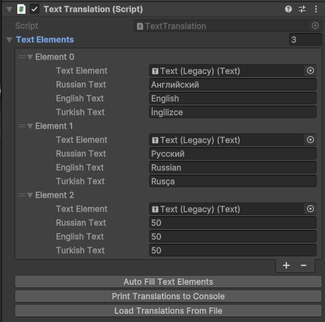

# Text Translation System for Unity

A simple and efficient text translation system for Unity, designed to manage multilingual content in your Unity project. This script enables automatic detection of the device language, supports loading translations from a `.txt` file, and offers easy logging of translations in a structured format for exporting or editing.

## Features

- **Automatic Language Detection**: Detects the system language on the first launch and applies it automatically.
- **Easy Language Switching**: Allows switching languages dynamically in the game (Russian, English, and Turkish supported by default).
- **Translation Logging and Exporting**: Generates a structured log of translations that can be copied directly to the clipboard.
- **Loading Translations from File**: Supports loading translations from a `.txt` file in a structured format based on the element index.

## How It Works

The script manages text components and translations as follows:

1. **Auto-Fill**: Automatically populates all `Text` components in the scene, assigning the default text as Russian (editable from the Inspector).
2. **Translation Loading**: Loads translations based on index from a `.txt` file formatted as:
   ```
   index-::(RU)%::-Russian text-::(EN)%::-English text-::(TR)%::-Turkish text
   ```
   Unfilled or mismatched fields are updated with values from the file.
3. **Logging**: Outputs all translations with indices in the same structured format to easily track and edit them.

### Example `.txt` Format for Importing Translations

```
0-::(RU)%::-Привет-::(EN)%::-Hello-::(TR)%::-Merhaba
1-::(RU)%::-Выход-::(EN)%::-Exit-::(TR)%::-Çıkış
2-::(RU)%::-Меню-::(EN)%::-Menu-::(TR)%::-Menü
```

## Getting Started

1. Attach the `TextTranslation` script to a GameObject in your Unity scene.
2. Populate translations via the Inspector or load them from a structured `.txt` file.
3. Use the available buttons in the Inspector for auto-filling elements, exporting logs, and loading translations.

## Usage in Unity Editor

In the Unity Editor, additional buttons are available:
- **Auto Fill Text Elements**: Automatically finds all `Text` components and fills them in the Inspector list.
- **Print Translations to Console**: Logs all translations in a structured format and copies them to the clipboard.
- **Load Translations From File**: Loads translations from a `.txt` file following the specified format.

---

# Система Переводов Текста для Unity

Простая и эффективная система перевода текста для Unity, разработанная для управления многоязычным контентом в вашем Unity-проекте. Скрипт автоматически определяет язык устройства, поддерживает загрузку переводов из `.txt` файла и предоставляет удобный формат для экспорта и редактирования переводов.

## Особенности

- **Автоматическое Определение Языка**: Определяет язык системы при первом запуске и автоматически применяет его.
- **Легкое Переключение Языка**: Позволяет динамически переключать язык в игре (по умолчанию поддерживаются русский, английский и турецкий).
- **Логирование и Экспорт Переводов**: Создаёт структурированный лог переводов, который можно скопировать в буфер обмена.
- **Загрузка Переводов из Файла**: Поддерживает загрузку переводов из `.txt` файла в структурированном формате на основе индекса элемента.

## Как Это Работает

Скрипт управляет текстовыми компонентами и переводами следующим образом:

1. **Автозаполнение**: Автоматически находит все компоненты `Text` в сцене, назначая текст по умолчанию как русский (редактируемый в инспекторе).
2. **Загрузка Переводов**: Загружает переводы по индексу из `.txt` файла, отформатированного так:
   ```
   index-::(RU)%::-Русский текст-::(EN)%::-English text-::(TR)%::-Turkish text
   ```
   Пустые или несоответствующие значения обновляются из файла.
3. **Логирование**: Выводит все переводы с индексами в том же структурированном формате для удобного отслеживания и редактирования.

### Пример Формата `.txt` для Импорта Переводов

```
0-::(RU)%::-Привет-::(EN)%::-Hello-::(TR)%::-Merhaba
1-::(RU)%::-Выход-::(EN)%::-Exit-::(TR)%::-Çıkış
2-::(RU)%::-Меню-::(EN)%::-Menu-::(TR)%::-Menü
```

## Начало Работы

1. Прикрепите скрипт `TextTranslation` к GameObject в вашей Unity-сцене.
2. Заполните переводы через инспектор или загрузите их из структурированного `.txt` файла.
3. Используйте доступные кнопки в инспекторе для автозаполнения элементов, экспорта лога и загрузки переводов.

## Использование в Unity Editor

В Unity Editor доступны дополнительные кнопки:
- **Auto Fill Text Elements**: Автоматически находит все компоненты `Text` и добавляет их в список в инспекторе.
- **Print Translations to Console**: Логирует все переводы в структурированном формате и копирует их в буфер обмена.
- **Load Translations From File**: Загружает переводы из `.txt` файла в указанном формате.

--- 

